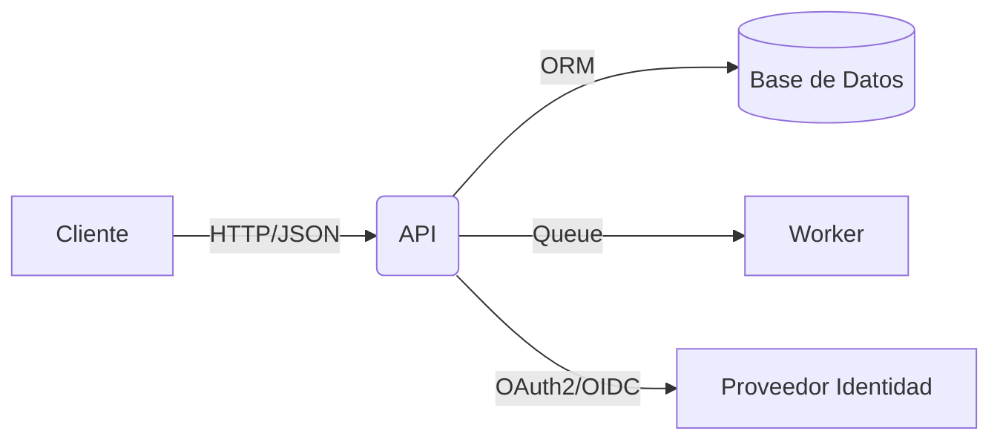

# Plan de Desarrollo

> Instrucciones: Completa cada sección. Mantén este documento vivo; actualízalo al cerrar decisiones y avanzar entregas. Usa enlaces a issues/PRs cuando aporte contexto.

## 1. Resumen Ejecutivo
- Descripción breve del problema y la solución propuesta.
- Objetivos clave (3–5 bullets medibles).
- Público objetivo y valor de negocio.
- Alcance inicial y fuera de alcance (out-of-scope).

## 2. Objetivos y Alcance
- Objetivos SMART del proyecto.
- Entregables principales.
- Límites y supuestos del alcance.

## 3. Stakeholders y Roles
| Nombre | Rol | Responsabilidades | Contacto |
|---|---|---|---|
| | | | |

## 4. Requisitos Funcionales
> Define historias/épicas. Usa criterios de aceptación claros (Given/When/Then si aplica).
| ID | Descripción | Prioridad (M/S/C) | Criterios de aceptación | Estado |
|---|---|---|---|---|
| RF-1 | | M | | Pendiente |

## 5. Requisitos No Funcionales
| Categoría (Rendimiento, Seguridad, UX, etc.) | Descripción | Objetivo/Métrica | Prioridad |
|---|---|---|---|
| Rendimiento | | p95 < X ms | M |

## 6. Arquitectura y Decisiones Clave
- Vista de alto nivel (componentes, servicios, módulos, flujos).
- Principios y restricciones (ej. mono-repo, 12-factor, DDD, event-driven, etc.).
- Decisiones con impacto (base de datos, framework, despliegue, autenticación).

Diagrama (borrador):

Decisiones de Arquitectura (ADR):
- Mantén un registro de ADRs en `docs/adr/` (uno por decisión). Opcionalmente, referencia aquí: ADR-001 Autenticación, ADR-002 Persistencia, ADR-003 Observabilidad, etc.

## 7. Diseño de Datos
- Principales entidades y relaciones.
- Esquema/migraciones previstas.
- Retención y políticas de borrado.

## 8. Integraciones y Dependencias
| Sistema | Tipo (API/Webhook/DB/SDK) | Protocolo | Autenticación | Entornos |
|---|---|---|---|---|
| | | | | Dev/Stage/Prod |

## 9. Roadmap e Hitos
> Hitos con resultados verificables y fechas tentativas.
| Hito | Descripción | Fecha | Criterio de Hecho |
|---|---|---|---|
| M1 | | | |

## 10. Plan de Entregas / Sprints
| Sprint | Objetivos | Alcance | Fechas | Riesgos |
|---|---|---|---|---|
| S1 | | | | |

## 11. Backlog Inicial
| ID | Tarea | Prioridad | Estimación | Dependencias | Estado |
|---|---|---|---|---|---|
| BK-1 | | Alta | | | Pendiente |

## 12. Calidad y Pruebas
- Estrategia: unitarias, integración, end-to-end, contratos, performance.
- Cobertura objetivo (%), componentes críticos, datos de prueba.
- QA gates en CI/CD (lint, tests, SAST/DAST, coverage threshold).

## 13. Seguridad y Cumplimiento
- Datos sensibles y clasificación.
- Autenticación, autorización, gestión de secretos.
- Requisitos regulatorios (GDPR/LOPD, PCI, etc.).
- Modelado de amenazas (alto nivel) y controles.

## 14. Observabilidad y Operaciones
- Logging, métricas, trazas. Dashboards y alertas.
- Procedimiento de despliegue y rollback.
- Gestión de configuraciones y feature flags.
- SLOs/SLAs y presupuesto de error.

## 15. Riesgos, Supuestos y Mitigaciones
| Riesgo | Impacto | Probabilidad | Mitigación | Plan de contingencia | Propietario |
|---|---|---|---|---|---|
| | | | | | |

## 16. Mantenimiento y Evolución
- Estrategia de versiones (semver), compatibilidad, migraciones.
- Plan de soporte y handover.
- Deuda técnica y plan de reducción.

## 17. Métricas de Éxito (KPIs)
| KPI | Definición | Objetivo | Fuente |
|---|---|---|---|
| | | | |

## 18. Anexos
- Glosario.
- Referencias (enlaces a PRDs, diseños, issues, PRs, diagramas, etc.).
- Plantillas útiles (ADR, historia de usuario, checklist de lanzamiento).

---

### Registro de Cambios
| Versión | Fecha | Cambios |
|---|---|---|
| 0.1.0 | <AAAA-MM-DD> | Borrador inicial |

