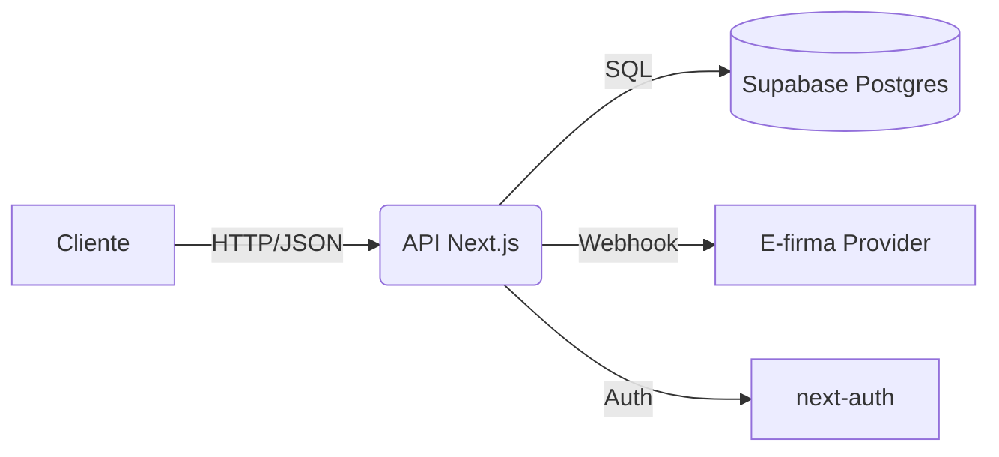

## Plan de Desarrollo

## 1. Resumen Ejecutivo

**Problema:** Clientes y socios inversionistas carecen de un portal digital para gestionar operaciones de factoring y ver rendimiento de sus inversiones. Actualmente, procesos son manuales y con poca trazabilidad.

**Solución:** Construir un portal de usuarios (clientes, inversionistas y accionistas/empleados) que digitalice el flujo completo: carga de facturas, análisis, oferta, firma, desembolso y seguimiento.

**Objetivos clave:**

* Reducir tiempo promedio desde SUBMITTED → FUNDED a menos de 7 días.
* 100% de operaciones con auditoría digital (documentos, estados, logs).
* 80% de clientes activos usando el portal dentro de 6 meses.
* Implementar dashboards para inversionistas antes de cerrar 2025.

**Público objetivo:**

* Empresas (clientes) que necesitan liquidez.
* Inversionistas que buscan retornos claros.
* Accionistas y empleados que requieren KPIs y control.

**Alcance inicial:** Portal clientes (MVP).
**Fuera de alcance:** Automatización completa de cobranza, integraciones profundas con ERPs (fase posterior).

## 2. Objetivos y Alcance

* **Objetivos SMART:**

  * Lanzar Portal Clientes (MVP) productivo al finalizar Sprint 3 (Q4 2025).
  * Soportar mínimo 50 operaciones concurrentes sin degradación (p95 < 300 ms).
  * Cumplimiento KYC/AML 100% digital.

* **Entregables:**

  * Portal Clientes funcional (facturas → funded).
  * Integración básica e-firma.
  * Panel staff (análisis y oferta).

* **Límites y supuestos:** OCR manual en MVP; e-firma con sandbox; cargas masivas diferidas.

## 3. Stakeholders y Roles

| Nombre               | Rol                | Responsabilidades                             | Contacto |
| -------------------- | ------------------ | --------------------------------------------- | -------- |
| Carlos Vives         | Product Owner      | Define visión y prioridades                   | —        |
| Eduardo Díazgranados | Gerente Financiero | Operación factoring y lineamientos de negocio | —        |
| Equipo Dev           | Desarrollo         | Implementación técnica y despliegue           | —        |

## 4. Requisitos Funcionales

| ID   | Descripción            | Prioridad | Criterios de aceptación                                 | Estado    |
| ---- | ---------------------- | --------- | ------------------------------------------------------- | --------- |
| RF-1 | Registro y KYC cliente | M         | Cliente puede registrarse y completar datos empresa     | Pendiente |
| RF-2 | Carga de facturas      | M         | Factura válida persiste en BD y visible en dashboard    | Pendiente |
| RF-3 | Oferta al cliente      | M         | Staff genera oferta y cliente puede aceptarla           | Pendiente |
| RF-4 | Firma de contrato      | M         | Firma vía proveedor externo y estado pasa a SIGNED      | Pendiente |
| RF-5 | Desembolso             | M         | Staff registra desembolso y cliente recibe confirmación | Pendiente |

## 5. Requisitos No Funcionales

| Categoría   | Descripción                          | Objetivo/Métrica              | Prioridad |
| ----------- | ------------------------------------ | ----------------------------- | --------- |
| Rendimiento | Tiempo respuesta APIs                | p95 < 300 ms                  | M         |
| Seguridad   | Autenticación multifactor            | MFA opcional                  | M         |
| UX          | Flujo wizard con validaciones claras | Error rate <5% en formularios | S         |

## 6. Arquitectura y Decisiones Clave

* **Stack:** Next.js 14 App Router + Supabase (Postgres con RLS) + Tailwind + shadcn/ui.
* **Decisiones:**

  * Sin Prisma, modelo en SQL + RLS.
  * E-firma abstraída (DocuSign/Zoho Sign).
  * Auth con next-auth (Credentials + Magic Link).
  * Infra: Vercel + Supabase.

## 7. Diseño de Datos

* **Entidades:** User, Org, Membership, Debtor, Operation, Invoice, Offer, Contract, Disbursement, Collection, AuditLog.
* **Relaciones:** Org tiene múltiples Operations, cada Operation múltiples Invoices.
* **Retención:** Logs 5 años, documentos según regulación.

## 8. Integraciones y Dependencias

| Sistema       | Tipo       | Protocolo    | Autenticación  | Entornos       |
| ------------- | ---------- | ------------ | -------------- | -------------- |
| Supabase      | DB/Storage | SQL/RLS      | JWT (Supabase) | Dev/Stage/Prod |
| DocuSign/Zoho | API        | REST/Webhook | OAuth/API Key  | Sandbox/Prod   |
| Resend        | API        | REST         | API Key        | Dev/Prod       |

## 9. Roadmap e Hitos

Roadmap completo: ver [docs/ROADMAP.md](./ROADMAP.md)

| Hito | Descripción         | Fecha   | Criterio de Hecho                    |
| ---- | ------------------- | ------- | ------------------------------------ |
| M1   | Sprint 1 entregable | Q4 2025 | Cliente crea solicitud y staff la ve |
| M2   | Sprint 2 entregable | Q4 2025 | Cliente acepta oferta                |
| M3   | Sprint 3 entregable | Q4 2025 | Flujo completo hasta funded          |

## 10. Plan de Entregas / Sprints

| Sprint | Objetivos                            | Alcance                                                | Fechas  | Riesgos                     |
| ------ | ------------------------------------ | ------------------------------------------------------ | ------- | --------------------------- |
| S1     | Identidad + Org + RBAC + Wizard base | Registro, selección Org, CRUD Deudores, subida factura | Q4 2025 | Configuración RLS           |
| S2     | Análisis + Oferta + Aceptación       | Panel staff, vista oferta, notificaciones              | Q4 2025 | Dependencia cálculos oferta |
| S3     | Firma + Desembolso + Seguimiento     | Integración e-firma, desembolso, timeline              | Q4 2025 | Proveedor e-firma           |
| S4     | Calidad + Auditoría                  | Pruebas e2e, exportables                               | Q1 2026 | Tiempo extra QA             |

## 11. Backlog Inicial

| ID   | Tarea                               | Prioridad | Estimación | Dependencias | Estado    |
| ---- | ----------------------------------- | --------- | ---------- | ------------ | --------- |
| BK-1 | Configurar Supabase + tablas núcleo | Alta      | 3d         | Ninguna      | Pendiente |
| BK-2 | Implementar auth con next-auth      | Alta      | 4d         | BK-1         | Pendiente |
| BK-3 | Scaffold wizard nueva solicitud     | Alta      | 5d         | BK-1         | Pendiente |

## 12. Calidad y Pruebas

* **Estrategia:** unitarias (Jest), integración (Supabase), e2e (Playwright).
* **Cobertura objetivo:** 80%.
* **CI/CD:** GitHub Actions con lint, test, coverage.

## 13. Seguridad y Cumplimiento

* **Datos sensibles:** PII, cuentas bancarias, documentos.
* **Autenticación:** next-auth con MFA opcional.
* **Regulación:** Retención de logs 5 años, GDPR/LOPD.
* **Controles:** RLS en BD, buckets segregados por org.

## 14. Observabilidad y Operaciones

* **Logs:** AuditLog por operación.
* **Métricas:** Tiempo SUBMITTED→FUNDED, tasa aprobación.
* **Deploy:** Vercel + rollback automático.
* **Feature flags:** activación progresiva.

## 15. Riesgos, Supuestos y Mitigaciones

| Riesgo                  | Impacto | Probabilidad | Mitigación        | Plan contingencia     | Propietario |
| ----------------------- | ------- | ------------ | ----------------- | --------------------- | ----------- |
| Falla proveedor e-firma | Alto    | Media        | Abstraer interfaz | Fallback manual       | Equipo Dev  |
| RLS mal configurado     | Alto    | Alta         | Tests automáticos | Auditoría externa     | Equipo Dev  |
| OCR baja precisión      | Medio   | Alta         | Captura manual    | Plantillas entrenadas | Equipo Dev  |

## 16. Mantenimiento y Evolución

* Versionado semver.
* Migraciones gestionadas en Supabase.
* Reducir deuda técnica documentando ADRs.

## 17. Métricas de Éxito (KPIs)

| KPI              | Definición              | Objetivo | Fuente                |
| ---------------- | ----------------------- | -------- | --------------------- |
| Tiempo operación | SUBMITTED→FUNDED        | <7 días  | BD / Logs             |
| Tasa aprobación  | % operaciones aprobadas | >60%     | Panel Staff           |
| CSAT             | Satisfacción clientes   | >80%     | Encuesta post-funding |

## 18. Anexos

* Glosario (ver documento Descripción de App).
* Referencias: Roadmap Fase 2, docs repos.
* ADRs en `docs/adr/`.

---

### Registro de Cambios

| Versión | Fecha      | Cambios          |
| ------- | ---------- | ---------------- |
| 0.1.0   | 2025-09-11 | Borrador inicial |
