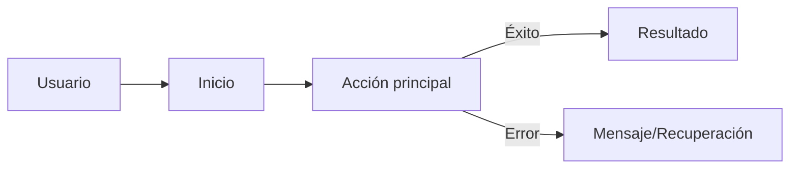

# Descripción de la App

> Instrucciones: Completa las secciones con lenguaje claro y orientado a negocio/usuarios. Añade enlaces a capturas o diagramas si ayuda.

## 1. Propósito y Visión
- ¿Qué problema resuelve la app?
- ¿Cuál es la visión a 6–12 meses?

## 2. Propuesta de Valor
- Beneficios principales para el usuario y para el negocio.
- Diferenciadores frente a alternativas.

## 3. Audiencia y Personas
- Persona 1: objetivos, dolores, motivaciones.
- Persona 2: objetivos, dolores, motivaciones.

## 4. Casos de Uso Principales
- Como <tipo de usuario>, quiero <acción> para <resultado>.
- Criterios de aceptación clave por caso de uso.

## 5. Funcionalidades Clave
- Lista priorizada (MVP primero), con breve descripción.

## 6. Flujo del Usuario (alto nivel)

## 7. Contenido y Tono
- Principios de UX/UI, tono de mensajes, idioma y localización.

## 8. Estado Actual
- Qué está hecho, qué falta, riesgos visibles.

## 9. Roadmap Breve
- Próximos 1–3 hitos con resultados verificables.

## 10. Glosario
- Término: definición breve.

## 11. Referencias
- Enlaces a diseños, PRDs, issues, capturas, demos, etc.

